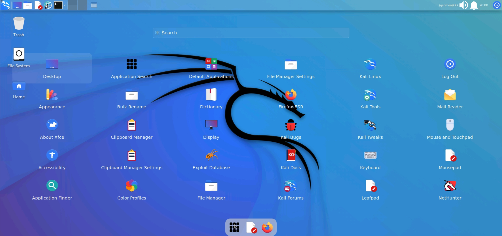

<b>Easily Install Full Kali Linux Nethunter Desktop in Termux</b>

### Features:

- Fixed Audio Output
- Fix Firefox  
- New theme
- Add new application menu
- Fix sdcard access problem etc...

### Installation:

- Install [Termux](https://termux.com) apk from [HERE](https://f-droid.org/repo/com.termux_118.apk)

  - `pkg update -y && pkg upgrade -y`
  - `pkg install wget -y`
  - `wget https://raw.githubusercontent.com/sabamdarif/nethunter-best/main/install-nethunter-termux`
  - `chmod +x install-nethunter-termux`
  - `./install-nethunter-termux`

  **Now Any select any of one opestion**

  If you select **full** , then run `./install-app-menu`

  If you select **others** , then run `./install-kali-desktop`

### VNC Uses
  - Type `kex` to run Vncserver
  - Do Not Use `kex &`
  - Type `kex stop` to stop Vncserver

- Install VNC VIEWER Apk on your Device. [Google Play Store](https://play.google.com/store/apps/details?id=com.realvnc.viewer.android&hl=en)
- Or, Install NetHunter KeX from [ Nethunter Store ](https://store.nethunter.com/en/packages/com.offsec.nethunter.kex/)

- Open VNC VIEWER & Click on + Button & Enter the Address `localhost:1` & Name anything you like
- Set the Picture Quality to High for better Quality
- Click on Connect & Input the Password 
- Enjoy :D
